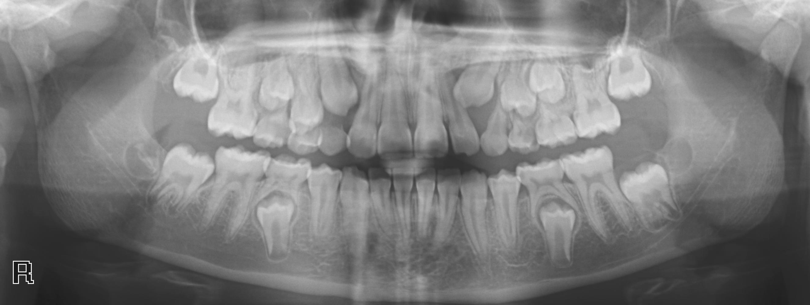
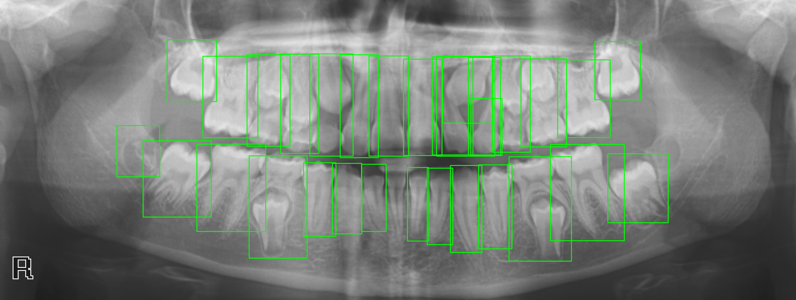

# Tooth recognizer from radiology

### Raw Radiology Image:

### Response:



### Scripts: 
Model has been trained in 'runs' directory but if you like to do it again, run this command:

```shell
python3 train_tooth_count.py
```
Run Application:

```shell
 uvicorn train_tooth_count_app:train_tooth_count_app --reload
```

> Project will serve in http://127.0.0.1:8000

### Test: 

```shell
curl -X 'POST' \
  'http://127.0.0.1:8000/predict/' \
  -H 'accept: application/json' \
  -H 'Content-Type: multipart/form-data' \
  -F 'file=@path_to_your_image/image.png'
```

[ Todo ] 1. Cavities (Caries): Early-stage or hidden decay.

[ Done ] 2. Periodontal Disease: Bone loss or gum disease.

[ Todo ] 3. Abscesses and Infections: Infections at the root or surrounding bone.

[Done] 4. Impacted Teeth: Wisdom teeth or other teeth that haven’t erupted properly.

[ Todo ] 5. Fractures: Tooth or jaw fractures.

[ Todo ] 6. Cysts and Tumors: Pathological growths.

[ Todo ] 7. Bone Loss: Associated with diseases like osteoporosis.

[ Todo ] 8. Root Canal Issues: Infection or incomplete treatments.

[ Todo ] 9. Malocclusion: Misaligned teeth and bite issues.

[ Todo ] 10. Orthodontic Planning: For braces or aligners.

[ Todo ] 11. Missing or Extra Teeth (Supernumerary teeth): Presence of extra or missing teeth.

[ Todo ] 12. Tooth Wear: From grinding or erosion.

[ Todo ] 13. Implant Planning: Assessing bone density and structure.